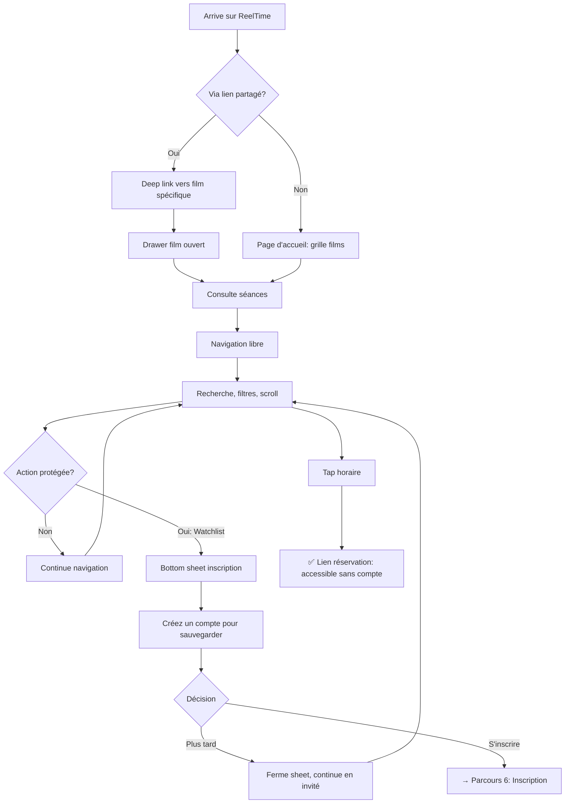

# UX Design Specification ReelTime v2

**Author:** Raphael
**Date:** 2026-02-04

---

## Executive Summary

### Project Vision

ReelTime v2 est une refonte architecturale d'un agrégateur de séances de cinéma pour Brest et Landerneau. L'objectif est de permettre aux utilisateurs de trouver et réserver une séance en moins de 30 secondes, avec une expérience fluide sur Web et Mobile (Android, puis iOS).

Le projet passe d'un monolithe Flask à une architecture moderne découplée (API Fastify + Web React + Mobile React Native) tout en **conservant l'identité visuelle distinctive** du site actuel.

### Target Users

- **Utilisateur principal :** Raphael (développeur, usage personnel)
- **Utilisateurs secondaires :** Cercle d'amis proches (~10-20 personnes)
- **Profil :** Cinéphiles locaux, tech-savvy, cherchant une alternative simple à AlloCiné
- **Devices :** Principalement mobile (Android), secondairement desktop
- **Contexte d'usage :** Décision spontanée ("qu'est-ce qu'on regarde ce soir ?") ou planification rapide après recommandation

### Key Design Challenges

| Défi | Description |
|------|-------------|
| **Performance perçue** | Objectif < 30 secondes pour trouver une séance — chaque tap compte |
| **Cohérence cross-platform** | Transposer le design vintage Web vers React Native sans perdre son âme |
| **Densité d'information** | Films, séances, cinémas, horaires, versions — éviter la surcharge cognitive |
| **Navigation temporelle** | Permettre une exploration fluide entre jours et semaines |

### Design Opportunities

| Opportunité | Impact potentiel |
|-------------|------------------|
| **Micro-interactions natives** | Haptic feedback, animations fluides 60fps — renforcer le côté premium |
| **Gestes intuitifs mobile** | Swipe horizontal pour changer de jour, pull-to-refresh vintage |
| **Personnalisation implicite** | Mémoriser préférences (cinéma favori, VO par défaut) pour résultats pertinents immédiatement |
| **Mode sombre vintage** | Variante "salle obscure" avec noir velours dominant et accents or/rouge |

### Design Identity to Preserve

**Thème :** Cinéma vintage français / Art Déco

**Palette de couleurs :**
- Rouge Cinéma `#D32F2F` — Accent principal
- Bordeaux Profond `#B71C1C` — États hover/pressed
- Or Antique `#FFD54F` — Highlights, badges
- Jaune Marquise `#F9A825` — Accents secondaires
- Crème Écran `#FFF8E1` — Surfaces claires
- Beige Papier `#EFEBE9` — Fond général
- Sépia Chaud `#8D6E63` — Bordures, texte secondaire
- Noir Velours `#1A1A1A` — Texte, overlays

**Typographies :**
- **Bebas Neue** — Headlines, labels (style affiche)
- **Playfair Display** — Titres de films (élégant)
- **Crimson Text** — Corps de texte (lisible)

**Éléments visuels signature :**
- Cartes "ticket de cinéma" avec coin coupé
- Effet spotlight/lueur dorée au hover
- Bordure pellicule de film
- Texture grain vintage subtile
- Diviseurs Art Déco

### Potential Design Improvements (to explore)

- **Animations d'entrée** — Cartes qui "tombent" comme des tickets
- **Transitions de page** — Effet rideau de cinéma entre écrans
- **Empty states** — Illustrations vintage (bobine, clap, projecteur)
- **Loading states** — Compte à rebours style "film commence dans..."
- **Onboarding** — Première visite façon "générique de film"

## Core User Experience

### Defining Experience

**Action principale :** Trouver une séance de cinéma et accéder à la réservation en moins de 30 secondes.

L'expérience ReelTime se définit par sa **rapidité d'exécution**. L'utilisateur ouvre l'app avec une intention claire ("qu'est-ce que je regarde ce soir ?" ou "où passe ce film ?") et doit obtenir sa réponse avec le minimum de friction.

**Boucle core :**
1. Ouvrir l'app → voir les films de la semaine (filtres mémorisés)
2. Parcourir / rechercher → trouver le film
3. Voir les séances → choisir l'horaire
4. Tap → redirection vers réservation externe

**Objectif :** ≤ 2 taps entre l'ouverture et le lien de réservation.

### Platform Strategy

**Approche : Mobile-First**

| Plateforme | Priorité | Stack | Notes |
|------------|----------|-------|-------|
| **Mobile Android** | MVP | React Native + Expo | Priorité #1, usage principal |
| **Web responsive** | MVP | React + Vite | Desktop & mobile browser |
| **Mobile iOS** | Phase 3 | React Native (même codebase) | Après validation Android |

**Considérations mobile-first :**
- Conception pour écrans tactiles en priorité
- Gestes natifs (swipe, pull-to-refresh, haptic feedback)
- Performance optimisée pour réseaux mobiles
- Cache offline via AsyncStorage
- PWA optionnel pour le Web (à évaluer)

**Responsive Web :**
- Le Web doit fonctionner parfaitement sur mobile browser
- Desktop = version étendue avec plus d'espace, pas une expérience différente

### Effortless Interactions

| Interaction | Comportement attendu | Friction éliminée |
|-------------|---------------------|-------------------|
| **Lancement** | Films affichés immédiatement avec filtres mémorisés | Pas de configuration à chaque ouverture |
| **Recherche** | Résultats en temps réel pendant la frappe | Pas de bouton "Rechercher" |
| **Navigation temporelle** | Swipe horizontal pour changer de jour | Pas de tap sur boutons < > |
| **Voir les séances** | Bottom sheet/drawer instantané | Pas de changement de page |
| **Filtres** | Toggle instantané, persistés automatiquement | Pas de bouton "Appliquer" |
| **Watchlist** | 1 tap + feedback haptic | Pas de confirmation |
| **Réservation** | Tap horaire → lien externe direct | Pas d'écran intermédiaire |

### Critical Success Moments

| Moment | Critère de succès | Risque si raté |
|--------|-------------------|----------------|
| **Premier lancement** | Comprend l'app en < 5 secondes sans onboarding | Abandon immédiat |
| **Recherche d'un film** | Trouve le film en < 3 secondes de frappe | Frustration, retour à Google |
| **Découverte** | "Oh, ce film passe cette semaine !" | App perçue comme inutile |
| **Choix d'horaire** | Voit toutes les options clairement (cinéma + heure + version) | Confusion, erreur de réservation |
| **Tap réservation** | Arrive sur le bon site en < 2 secondes | Perte de confiance |
| **Retour après pause** | Retrouve exactement son contexte (filtres, position) | Sentiment de recommencer |

### Experience Principles

1. **Zéro configuration** — L'app fonctionne parfaitement dès le premier lancement, les préférences s'affinent avec l'usage
2. **Résultats immédiats** — Chaque action produit un feedback instantané, jamais de "chargement..."
3. **Gestes naturels** — Swipe, tap, pull : les interactions sont celles que l'utilisateur attend instinctivement
4. **Persistance invisible** — Filtres, recherches, position : l'app "se souvient" sans que l'utilisateur y pense
5. **Sortie rapide** — L'objectif est d'amener l'utilisateur vers la réservation externe, pas de le retenir dans l'app

## Desired Emotional Response

### Primary Emotional Goals

**Double objectif émotionnel : Efficacité + Plaisir**

| Émotion | Intensité | Manifestation |
|---------|-----------|---------------|
| **Efficacité** | Forte | "J'ai trouvé ce que je cherchais instantanément" |
| **Plaisir esthétique** | Moyenne | "Cette app est belle, j'aime l'utiliser" |
| **Nostalgie cinéma** | Subtile | Le design vintage évoque l'ambiance des salles obscures |
| **Anticipation** | Variable | L'excitation de planifier une sortie ciné |
| **Confiance** | Constante | "Cette app fonctionne toujours parfaitement" |

**Équilibre recherché :** L'efficacité ne doit jamais être sacrifiée pour l'esthétique, mais l'esthétique renforce le plaisir d'usage et la mémorabilité de l'app.

### Emotional Journey Mapping

| Étape | Émotion visée | Comment la créer |
|-------|---------------|------------------|
| **Lancement** | Familiarité + Anticipation | Écran immédiat, design reconnaissable, films affichés |
| **Exploration** | Curiosité + Découverte | Affiches attrayantes, infos claires, scroll fluide |
| **Recherche** | Confiance + Efficacité | Résultats instantanés, feedback immédiat |
| **Choix séance** | Clarté + Excitation | Drawer élégant, horaires bien organisés |
| **Tap réservation** | Satisfaction + Impatience (positive) | Transition rapide, "j'y suis presque" |
| **Retour app** | Confort + Continuité | Contexte préservé, "comme à la maison" |
| **Erreur/vide** | Compréhension (pas frustration) | Messages clairs, illustrations vintage, humour léger |

### Micro-Emotions

**À cultiver :**

| Micro-émotion | Déclencheur UX |
|---------------|----------------|
| **Satisfaction** | Tap → feedback haptic + visuel instantané |
| **Délice** | Micro-animations soignées (cartes, transitions) |
| **Maîtrise** | Filtres qui "comprennent" mes préférences |
| **Surprise agréable** | Détails visuels inattendus (textures, reflets) |
| **Appartenance** | Design unique qui différencie de la masse |

**À éviter :**

| Micro-émotion | Cause à éliminer |
|---------------|------------------|
| **Impatience** | Spinners, délais perceptibles |
| **Doute** | Boutons ambigus, états incertains |
| **Déception** | Promesse visuelle non tenue (lien mort, erreur) |
| **Ennui** | Interface générique, sans personnalité |

### Design Implications

| Émotion cible | Implication UX |
|---------------|----------------|
| **Efficacité** | Skeleton screens, pas de spinners. Données en cache. Navigation prédictive. |
| **Plaisir** | Animations 60fps, transitions fluides, haptic feedback sur mobile |
| **Nostalgie** | Palette vintage cohérente, typographies classiques, textures subtiles |
| **Confiance** | États clairs (loading/error/empty), feedback sur chaque action |
| **Anticipation** | Affiches de qualité, infos film engageantes, countdown visuel vers séance |

**Règle d'or :** Chaque milliseconde gagnée en performance = plus de budget pour le plaisir visuel.

### Emotional Design Principles

1. **Performance = Émotion** — La rapidité EST une émotion positive. Un délai de 200ms transforme l'efficacité en frustration.

2. **Le vintage au service du plaisir** — L'esthétique cinéma n'est pas décorative : elle crée une ambiance émotionnelle unique qui différencie l'app.

3. **Micro-délices constants** — Chaque interaction est une opportunité de créer un petit moment de plaisir (animation, son, haptic).

4. **Erreurs avec grâce** — Les moments négatifs (recherche vide, erreur réseau) doivent être traités avec humour et élégance vintage.

5. **Familiarité progressive** — L'app devient plus agréable avec l'usage : elle "apprend" les préférences et récompense la fidélité par la fluidité.

## UX Pattern Analysis & Inspiration

### Inspiring Products Analysis

#### Letterboxd — L'élégance cinéphile

| Aspect | Ce qu'ils font bien | Applicable à ReelTime |
|--------|---------------------|----------------------|
| **Design** | Esthétique sombre, affiches en vedette, typographie soignée | Inspiration pour le mode sombre vintage |
| **Cards films** | Posters grands, infos minimales, hover reveal | Cartes ticket avec reveal au tap |
| **Navigation** | Simple, peu de niveaux, recherche omniprésente | Garder la structure plate |
| **Détail film** | Scroll infini élégant, sections claires | Drawer avec sections accordéon |

#### Airbnb — La fluidité de recherche

| Aspect | Ce qu'ils font bien | Applicable à ReelTime |
|--------|---------------------|----------------------|
| **Filtres** | Bottom sheet natif, chips visuels, feedback immédiat | Filtres en chips persistants |
| **Recherche** | Suggestions en temps réel, historique | Recherche instantanée + récents |
| **Cards** | Images hero, infos essentielles, prix visible | Affiche + titre + horaire prochain |
| **Maps** | Vue carte intégrée naturellement | Carte des cinémas (existante) |

#### Apple Music — Le premium mobile

| Aspect | Ce qu'ils font bien | Applicable à ReelTime |
|--------|---------------------|----------------------|
| **Transitions** | Animations fluides 60fps, continuité visuelle | Transitions drawer/cards |
| **Haptics** | Feedback tactile sur chaque action | Tap séance, ajout watchlist |
| **Now Playing** | Mini-player persistant, accès rapide | Mini-bar "prochaine séance" (Phase 2) |
| **Typographie** | Hiérarchie claire, titres bold | Bebas + Playfair hiérarchisés |

#### Notion — La rapidité perçue

| Aspect | Ce qu'ils font bien | Applicable à ReelTime |
|--------|---------------------|----------------------|
| **Skeleton screens** | Contenu placeholder instantané | Skeleton pour cards films |
| **Offline** | Fonctionne sans réseau, sync en fond | Cache agressif, offline-first |
| **Keyboard shortcuts** | Power users récompensés | Raccourcis Web (←/→ semaine) |
| **Cmd+K** | Recherche universelle rapide | Recherche focus au launch |

#### Duolingo — Les micro-délices

| Aspect | Ce qu'ils font bien | Applicable à ReelTime |
|--------|---------------------|----------------------|
| **Micro-animations** | Chaque action a un feedback joyeux | Animation ajout watchlist |
| **Empty states** | Illustrations charmantes, messages encourageants | Illustrations vintage pour états vides |
| **Progression** | Sentiment d'accomplissement constant | Compteur séances vues (Phase 2) |
| **Personnalité** | Ton unique, mascotte mémorable | Personnalité vintage cohérente |

### Transferable UX Patterns

**Navigation :**

| Pattern | Source | Application ReelTime |
|---------|--------|---------------------|
| Bottom sheet natif | Airbnb, Apple Music | Drawer détail film |
| Tabs simples | Letterboxd | Home / Recherche / Calendrier / Profil |
| Swipe horizontal | Apple Music | Navigation jours de la semaine |
| Pull-to-refresh | Standard iOS/Android | Actualiser les séances |

**Interactions :**

| Pattern | Source | Application ReelTime |
|---------|--------|---------------------|
| Recherche live | Airbnb, Notion | Filtrage instantané pendant frappe |
| Chips toggle | Airbnb | Filtres cinéma/version/horaire |
| Long press | Apple Music | Options rapides (watchlist, partage) |
| Haptic feedback | Apple Music | Confirmation tap séance |
| Skeleton loading | Notion | Placeholder cards pendant chargement |

**Visuels :**

| Pattern | Source | Application ReelTime |
|---------|--------|---------------------|
| Cards avec image hero | Letterboxd, Airbnb | Cartes films avec affiche dominante |
| Gradients sur images | Letterboxd | Overlay texte sur affiches |
| Typographie expressive | Apple Music | Bebas pour impact, Playfair pour élégance |
| Illustrations empty state | Duolingo | Bobine/clap vintage si aucun résultat |

### Anti-Patterns to Avoid

| Anti-pattern | Vu dans | Pourquoi l'éviter |
|--------------|---------|-------------------|
| **Splash screen long** | Apps corporate | Tue l'efficacité, frustrant au quotidien |
| **Onboarding obligatoire** | Beaucoup d'apps | L'utilisateur veut agir, pas apprendre |
| **Bouton "Appliquer" filtres** | Sites web legacy | Friction inutile, feedback doit être immédiat |
| **Spinner centré** | Partout | Sensation de lenteur, préférer skeleton |
| **Modal de confirmation** | Apps prudentes | 1 tap = 1 action, undo plutôt que confirm |
| **Infinite scroll sans repère** | Réseaux sociaux | Perdition, préférer pagination par semaine |
| **Hamburger menu** | Apps 2015 | Cache la navigation, préférer tab bar |
| **Texte placeholder générique** | Apps génériques | "Aucun résultat" → "Pas de film vintage ce soir ?" |

### Design Inspiration Strategy

**À adopter directement :**

| Pattern | Raison |
|---------|--------|
| Bottom sheet pour détails | Standard mobile, attendu par les utilisateurs |
| Skeleton screens | Performance perçue sans effort technique |
| Haptic feedback | Différenciateur premium, facile à implémenter |
| Swipe navigation jours | Geste naturel, réduit les taps |
| Chips filtres | Visuel, compact, feedback immédiat |

**À adapter au style vintage :**

| Pattern | Adaptation |
|---------|------------|
| Cards Letterboxd | Coin coupé ticket, bordure sépia, texture grain |
| Gradients Apple Music | Gradients chauds (bordeaux → noir) au lieu de froids |
| Illustrations Duolingo | Style Art Déco / affiche années 30 |
| Transitions fluides | Effet "rideau" ou "pellicule" sur transitions majeures |

**À éviter absolument :**

| Anti-pattern | Alternative ReelTime |
|--------------|---------------------|
| Splash screen | Lancement direct sur contenu |
| Onboarding forcé | Découverte progressive contextuelle |
| Confirmation modals | Action + undo toast |
| Spinners | Skeletons vintage (formes ticket) |
| Hamburger menu | Tab bar 4 items max |

## Design System Foundation

### Design System Choice

**Choix : Tailwind CSS + NativeWind**

| Plateforme | Technologie | Rôle |
|------------|-------------|------|
| **Web** | Tailwind CSS v3+ | Styles utilitaires, responsive |
| **Mobile** | NativeWind v4 | Tailwind pour React Native |
| **Partagé** | tailwind.config.js | Tokens de design unifiés |

### Rationale for Selection

| Critère | Justification |
|---------|---------------|
| **Continuité** | Le site Flask actuel utilise Tailwind — même mental model |
| **Cross-platform** | Une seule config pour Web et Mobile |
| **Personnalisation** | Aucune contrainte visuelle — vintage custom possible |
| **Performance** | CSS atomique, pas de runtime JavaScript |
| **Équipe solo** | Une syntaxe à maîtriser, documentation abondante |
| **Écosystème** | Compatible React, Vite, Expo sans friction |

### Implementation Approach

**Structure des tokens partagés :**

```javascript
// tailwind.config.js (partagé Web + Mobile)
module.exports = {
  theme: {
    extend: {
      colors: {
        'rouge-cinema': '#D32F2F',
        'bordeaux-profond': '#B71C1C',
        'or-antique': '#FFD54F',
        'jaune-marquise': '#F9A825',
        'creme-ecran': '#FFF8E1',
        'beige-papier': '#EFEBE9',
        'sepia-chaud': '#8D6E63',
        'noir-velours': '#1A1A1A',
      },
      fontFamily: {
        'bebas': ['Bebas Neue', 'sans-serif'],
        'playfair': ['Playfair Display', 'serif'],
        'crimson': ['Crimson Text', 'serif'],
      },
      borderRadius: {
        'ticket': '8px',
      },
      boxShadow: {
        'vintage': '0 4px 6px rgba(0, 0, 0, 0.1), inset 0 1px 0 rgba(255, 255, 255, 0.8)',
      },
    },
  },
}
```

**Organisation des composants :**

```
packages/
├── ui/                     # Composants partagés
│   ├── FilmCard/
│   ├── ShowtimeChip/
│   ├── FilterBar/
│   └── BottomSheet/
├── web/                    # App React + Vite
│   └── src/
│       ├── components/     # Composants Web-specific
│       └── styles/         # CSS custom (textures, animations)
└── mobile/                 # App React Native + Expo
    └── src/
        ├── components/     # Composants Mobile-specific
        └── utils/          # Haptics, gestures
```

### Customization Strategy

**Niveau 1 — Tokens (partagés) :**
- Couleurs vintage (palette définie)
- Typographies (Bebas, Playfair, Crimson)
- Espacements et rayons cohérents
- Ombres et effets

**Niveau 2 — Composants de base (partagés) :**
- `<FilmCard>` — Carte ticket avec coin coupé
- `<ShowtimeChip>` — Bouton horaire stylisé
- `<FilterChip>` — Chip toggle pour filtres
- `<VintageButton>` — Bouton avec style vintage
- `<BottomSheet>` — Drawer détail film

**Niveau 3 — Effets spéciaux (platform-specific) :**

| Effet | Web | Mobile |
|-------|-----|--------|
| Texture grain | CSS `background-image` SVG | Image overlay |
| Spotlight hover | CSS `::after` + gradient | N/A (pas de hover) |
| Animations | Framer Motion | Reanimated 3 |
| Haptics | N/A | expo-haptics |
| Swipe gestures | N/A | react-native-gesture-handler |

**Niveau 4 — Extensions futures :**
- Mode sombre vintage (palette alternative)
- Thèmes saisonniers (Noël, Halloween)
- Accessibilité (contraste élevé)

## Defining Experience

### The Core Interaction

**L'expérience définissante de ReelTime :**

> "Tu ouvres l'app, tu vois les films, tu tap sur l'horaire, t'es sur la réservation. 30 secondes."

| App | Expérience définissante |
|-----|------------------------|
| Tinder | Swipe pour matcher |
| Shazam | Tap pour identifier une chanson |
| Uber | Voir la voiture arriver en temps réel |
| **ReelTime** | Tap séance → réservation instantanée |

### User Mental Model

**Parcours actuel (sans ReelTime) :**
1. "Je veux voir un film ce soir"
2. Google "cinéma Brest" ou ouvre AlloCiné
3. Cherche dans plusieurs cinémas séparément
4. Compare horaires et versions manuellement
5. Trouve le lien de réservation (parfois compliqué)

**Parcours ReelTime :**
1. "Je veux voir un film" → Ouvre ReelTime
2. Tous les cinémas déjà agrégés + filtres mémorisés
3. Tap sur horaire = lien direct réservation

**Frustrations éliminées :**
- Navigation entre plusieurs sites/apps
- Re-configuration des filtres à chaque visite
- Recherche du lien de réservation caché
- Comparaison manuelle des horaires

### Success Criteria

| Critère | Objectif | Mesure |
|---------|----------|--------|
| **Temps total** | < 30 secondes | Ouverture → tap réservation |
| **Nombre de taps** | ≤ 2 taps | Pour arriver au lien externe |
| **Configuration** | Zéro | Filtres mémorisés automatiquement |
| **Feedback** | Instantané | Chaque tap = réponse < 100ms |
| **Fiabilité** | 100% | Liens de réservation toujours fonctionnels |

### Novel UX Patterns

**Approche : Patterns établis + twist vintage**

| Pattern | Type | Application ReelTime |
|---------|------|---------------------|
| Bottom sheet détail | Établi | Drawer film avec style ticket |
| Swipe navigation | Établi | Changement de jour horizontal |
| Chips filtres | Établi | Filtres cinéma/version/horaire |
| Tap = action directe | Établi | Horaire → lien externe immédiat |
| Long press = secondaire | Établi | Ajouter à watchlist |
| **Carte ticket** | Novel | Coin coupé, perforations, texture |
| **Feedback vintage** | Novel | Animations rideau, pellicule |

**Aucune interaction nouvelle à enseigner** — Tous les gestes sont familiers. L'innovation est dans l'esthétique et la vitesse, pas dans les patterns d'interaction.

### Experience Mechanics

```
┌─────────────────────────────────────────────────────────┐
│  1. OUVERTURE                                           │
│     └─ App s'ouvre directement sur liste des films     │
│     └─ Filtres déjà appliqués (localStorage/AsyncStorage)│
│     └─ Semaine actuelle par défaut                     │
│     └─ Skeleton visible < 50ms si données en cache     │
├─────────────────────────────────────────────────────────┤
│  2. DÉCOUVERTE                                          │
│     └─ Scroll vertical : parcourir les films (grille)  │
│     └─ Swipe horizontal : changer de jour/semaine      │
│     └─ Recherche : frappe = résultats instantanés      │
│     └─ Filtres : toggle = effet immédiat               │
├─────────────────────────────────────────────────────────┤
│  3. SÉLECTION                                           │
│     └─ Tap sur carte film → Drawer s'ouvre (300ms)     │
│     └─ Séances groupées : jour > cinéma > horaire      │
│     └─ Horaires = boutons colorés (version visible)    │
│     └─ Swipe down ou tap X = fermer drawer             │
├─────────────────────────────────────────────────────────┤
│  4. ACTION                                              │
│     └─ Tap horaire → Lien externe (nouvelle tab/app)   │
│     └─ Long press horaire → Ajouter watchlist          │
│     └─ Feedback : haptic (mobile) + toast confirmation │
│     └─ Horaire watchlist = couleur différente (or)     │
└─────────────────────────────────────────────────────────┘
```

**États d'erreur avec grâce :**

| Situation | Réponse UX |
|-----------|------------|
| Recherche sans résultat | Illustration vintage + "Pas de film trouvé" |
| Erreur réseau | Toast + données en cache si disponibles |
| Lien réservation mort | Message d'excuse + lien vers site cinéma |
| Aucune séance aujourd'hui | Suggestion du prochain jour avec séances |

## Visual Design Foundation

### Color System

**Mode clair (par défaut) — "Journée au cinéma"**

| Token | Hex | Usage |
|-------|-----|-------|
| `primary` | `#D32F2F` | Boutons, liens, accents principaux |
| `primary-dark` | `#B71C1C` | Hover, pressed states |
| `secondary` | `#FFD54F` | Highlights, badges, watchlist |
| `secondary-dark` | `#F9A825` | Hover secondary |
| `surface` | `#FFF8E1` | Cards, surfaces élevées |
| `background` | `#EFEBE9` | Fond de page |
| `border` | `#8D6E63` | Bordures, séparateurs |
| `text-primary` | `#1A1A1A` | Texte principal |
| `text-secondary` | `#8D6E63` | Texte secondaire, placeholders |
| `text-on-primary` | `#FFF8E1` | Texte sur fond primary |

**Mode sombre — "Salle obscure"**

| Token | Hex | Usage |
|-------|-----|-------|
| `primary` | `#EF5350` | Rouge plus vif pour contraste |
| `primary-dark` | `#D32F2F` | Hover, pressed states |
| `secondary` | `#FFD54F` | Or antique (inchangé) |
| `secondary-dark` | `#FFC107` | Hover secondary |
| `surface` | `#2D2D2D` | Cards, surfaces élevées |
| `background` | `#1A1A1A` | Fond de page (noir velours) |
| `border` | `#5D4037` | Bordures sépia assombri |
| `text-primary` | `#FFF8E1` | Texte crème |
| `text-secondary` | `#BCAAA4` | Texte secondaire |
| `text-on-primary` | `#1A1A1A` | Texte sur fond primary |

**Couleurs sémantiques (partagées) :**

| Token | Clair | Sombre | Usage |
|-------|-------|--------|-------|
| `success` | `#4CAF50` | `#66BB6A` | Confirmations, ajout watchlist |
| `warning` | `#FF9800` | `#FFA726` | Alertes non-critiques |
| `error` | `#F44336` | `#EF5350` | Erreurs, suppressions |
| `info` | `#2196F3` | `#42A5F5` | Informations neutres |

### Typography System

**Échelle typographique :**

| Token | Taille | Poids | Police | Usage |
|-------|--------|-------|--------|-------|
| `display` | 32px | 400 | Bebas Neue | Titres de page |
| `headline` | 24px | 700 | Playfair Display | Titres de films |
| `title` | 20px | 600 | Playfair Display | Sous-titres, sections |
| `subtitle` | 16px | 600 | Crimson Text | Labels importants |
| `body` | 14px | 400 | Crimson Text | Texte courant |
| `caption` | 12px | 400 | Crimson Text | Métadonnées, dates |
| `label` | 11px | 400 | Bebas Neue | Chips, badges, uppercase |

**Line heights :**
- Display/Headline : 1.2
- Title/Subtitle : 1.3
- Body : 1.5
- Caption/Label : 1.4

**Règles typographiques :**
- Bebas Neue : toujours uppercase, letter-spacing 0.05em
- Playfair Display : titres uniquement, jamais plus de 2 lignes
- Crimson Text : texte courant, italique pour métadonnées

### Spacing & Layout Foundation

**Système d'espacement (base 8px) :**

| Token | Valeur | Usage |
|-------|--------|-------|
| `space-1` | 4px | Micro-espacements (icône + texte) |
| `space-2` | 8px | Espacement interne compact |
| `space-3` | 12px | Espacement standard |
| `space-4` | 16px | Séparation d'éléments |
| `space-5` | 24px | Séparation de sections |
| `space-6` | 32px | Marges de page mobile |
| `space-8` | 48px | Séparation majeure |

**Layout mobile-first :**

| Breakpoint | Largeur | Colonnes grille | Gouttière |
|------------|---------|-----------------|-----------|
| Mobile | < 640px | 2 colonnes | 12px |
| Tablet | 640-1024px | 3 colonnes | 16px |
| Desktop | > 1024px | 4-5 colonnes | 20px |

**Rayons de bordure :**

| Token | Valeur | Usage |
|-------|--------|-------|
| `rounded-sm` | 4px | Chips, petits éléments |
| `rounded` | 8px | Cards, boutons |
| `rounded-lg` | 12px | Modals, drawers |
| `rounded-xl` | 16px | Bottom sheet |
| `rounded-full` | 9999px | Avatars, badges circulaires |

**Élévations (ombres) :**

| Token | Valeur | Usage |
|-------|--------|-------|
| `shadow-sm` | `0 1px 2px rgba(0,0,0,0.1)` | Chips, petits éléments |
| `shadow` | `0 4px 6px rgba(0,0,0,0.1)` | Cards |
| `shadow-lg` | `0 10px 20px rgba(0,0,0,0.15)` | Drawers, modals |
| `shadow-vintage` | `0 4px 6px rgba(0,0,0,0.1), inset 0 1px 0 rgba(255,255,255,0.8)` | Effet ticket vintage |

### Accessibility Considerations

**Contraste WCAG AA :**

| Combinaison | Ratio | Status |
|-------------|-------|--------|
| Texte noir sur beige papier | 12.6:1 | ✅ AAA |
| Texte crème sur rouge cinéma | 4.8:1 | ✅ AA |
| Texte sépia sur crème écran | 4.1:1 | ✅ AA |
| Texte crème sur noir velours | 15.2:1 | ✅ AAA |

**Tailles minimales :**
- Touch targets : 44x44px minimum (iOS/Android guidelines)
- Texte body : 14px minimum
- Texte caption : 12px minimum

**Supports :**
- Respect du mode sombre système (prefers-color-scheme)
- Support du mode contraste élevé (prefers-contrast)
- Animations réduites si demandé (prefers-reduced-motion)

## Design Direction Decision

### Design Directions Explored

**Direction unique retenue : Vintage Cinéma Français**

Étant donné l'identité visuelle existante appréciée par l'utilisateur, une seule direction a été explorée et validée, avec des variations de thème (clair/sombre) et de densité (responsive).

| Alternative considérée | Raison du rejet |
|------------------------|-----------------|
| Design minimaliste moderne | Perte de l'identité distinctive |
| Material Design standard | Trop générique, manque de personnalité |
| Design brutaliste | Ne correspond pas à l'ambiance cinéma |
| Flat design coloré | Conflictuel avec l'esthétique vintage |

### Chosen Direction

**Direction : Vintage Cinéma Français / Art Déco**

| Aspect | Spécification |
|--------|---------------|
| **Thème principal** | Cinéma vintage français années 30-50 |
| **Influence secondaire** | Art Déco, affiches de cinéma d'époque |
| **Palette** | Rouges chauds, ors antiques, crèmes, sépias |
| **Typographie** | Trio Bebas + Playfair + Crimson |
| **Textures** | Grain subtil, effet papier vieilli |
| **Formes** | Coins coupés ticket, bordures arrondies |
| **Iconographie** | Pellicule, bobine, clap, projecteur |

**Variations prévues :**

| Variation | Description | Déclencheur |
|-----------|-------------|-------------|
| **Mode clair** | Fond beige, cartes crème, texte noir | Par défaut / prefers-color-scheme: light |
| **Mode sombre** | Fond noir velours, cartes grises, texte crème | prefers-color-scheme: dark |
| **Densité mobile** | 2 colonnes, espacement 12px | < 640px |
| **Densité tablet** | 3 colonnes, espacement 16px | 640-1024px |
| **Densité desktop** | 4-5 colonnes, espacement 20px | > 1024px |

### Design Rationale

**Pourquoi cette direction :**

| Critère | Justification |
|---------|---------------|
| **Continuité** | Préserve l'identité du site actuel que l'utilisateur apprécie |
| **Différenciation** | Se distingue radicalement d'AlloCiné, Pathé, UGC |
| **Émotion** | Évoque la nostalgie et l'excitation d'aller au cinéma |
| **Cohérence** | Un thème fort qui guide toutes les décisions |
| **Mémorabilité** | Design unique facilement reconnaissable |

**Risques et mitigations :**

| Risque | Mitigation |
|--------|------------|
| Trop chargé visuellement | Utiliser les textures avec parcimonie |
| Lisibilité compromise | Respecter les ratios de contraste WCAG |
| Fatigue visuelle | Mode sombre + respect prefers-reduced-motion |
| Incohérence cross-platform | Tokens partagés via Tailwind config |

### Implementation Approach

**Phase 1 — Tokens de base :**
- Définir les couleurs dans tailwind.config.js
- Configurer les modes clair/sombre
- Établir l'échelle typographique
- Définir les espacements et rayons

**Phase 2 — Composants de base :**
- `<FilmCard>` — Carte ticket avec coin coupé
- `<ShowtimeChip>` — Bouton horaire stylisé
- `<VintageButton>` — Bouton avec hover spotlight
- `<BottomSheet>` — Drawer avec bord arrondi top

**Phase 3 — Effets spéciaux :**
- Texture grain (CSS background-image)
- Animations d'entrée (Framer Motion / Reanimated)
- Transitions rideau (page transitions)
- Haptic feedback (mobile)

**Phase 4 — Polissage :**
- Empty states illustrés
- Loading skeletons vintage
- Micro-animations de feedback
- Easter eggs visuels (optionnel)

## User Journey Flows

### Parcours 1 : Film recommandé

**Contexte :** Un ami envoie "T'as vu Dune 2 en VO ?" → L'utilisateur veut trouver une séance rapidement.

**Objectif :** Recherche → Filtre VO → Séance trouvée → Réservation en < 1 minute

```mermaid
flowchart TD
    A[Ouvre ReelTime] --> B{Films en cache?}
    B -->|Oui| C[Affiche grille films]
    B -->|Non| C2[Skeleton + fetch API]
    C2 --> C

    C --> D[Tap barre recherche]
    D --> E[Frappe "Dune"]
    E --> F[Résultats instantanés]

    F --> G{Film trouvé?}
    G -->|Non| H[Message "Aucun résultat"]
    H --> I[Suggestion: vérifier orthographe]

    G -->|Oui| J[Tap sur carte Dune 2]
    J --> K[Drawer s'ouvre]

    K --> L[Tap filtre "VO"]
    L --> M[Séances VO uniquement]

    M --> N[Tap horaire 20h30]
    N --> O{Dans watchlist?}

    O -->|Non| P[Ouvre lien réservation externe]
    O -->|Oui| Q[Confirmation déjà ajouté]

    P --> R[✅ Succès: Site cinéma ouvert]
```

**Points clés UX :**
- Recherche live pendant la frappe (pas de bouton)
- Filtres persistés → si l'utilisateur préfère toujours VO, c'est mémorisé
- 4 taps max : Recherche → Film → Filtre → Horaire

---

### Parcours 2 : Envie spontanée

**Contexte :** Vendredi 18h, envie de ciné sans idée précise.

**Objectif :** Parcourir → Découvrir → Choisir → Réserver en 2-3 minutes

```mermaid
flowchart TD
    A[Ouvre ReelTime] --> B[Grille films semaine courante]
    B --> C[Scroll vertical: parcourir]

    C --> D{Film intéressant?}
    D -->|Non| C

    D -->|Oui| E[Tap sur carte film]
    E --> F[Drawer: infos + séances]

    F --> G[Consulte synopsis/casting]
    G --> H{Convaincu?}

    H -->|Non| I[Swipe down ferme drawer]
    I --> C

    H -->|Oui| J[Parcourt séances par jour]
    J --> K[Tap filtre "≥20h"]
    K --> L[Séances soirée uniquement]

    L --> M[Compare cinémas]
    M --> N[Tap horaire choisi]

    N --> O{Connecté?}
    O -->|Oui| P[Long press → Ajouter watchlist]
    O -->|Non| Q[Tap → Lien réservation]

    P --> R[Toast "Ajouté!"]
    R --> Q
    Q --> S[✅ Succès: Réservation en cours]
```

**Points clés UX :**
- Navigation par scroll naturel
- Drawer = preview rapide sans quitter la grille mentalement
- Filtres horaires pour affiner rapidement
- Long press = action secondaire (watchlist)

---

### Parcours 5 : Visiteur invité

**Contexte :** Reçoit un lien partagé ou découvre l'app, pas de compte.

**Objectif :** Consulter librement → Incitation douce à s'inscrire



**Points clés UX :**
- Aucun mur d'inscription à l'entrée
- Toutes les fonctions de consultation accessibles
- Incitation contextuelle (quand l'utilisateur VEUT sauvegarder)
- La fonction core (réservation) reste accessible

---

### Parcours 6 : Nouvel inscrit

**Contexte :** L'utilisateur décide de créer un compte.

**Objectif :** Inscription rapide → Retour immédiat à l'action initiale

```mermaid
flowchart TD
    A[Déclenche inscription] --> B{Contexte?}

    B -->|Depuis watchlist| C[Mémorise: film + action]
    B -->|Depuis profil| D[Pas de contexte]

    C --> E[Formulaire inscription]
    D --> E

    E --> F[Champs: Email + Mot de passe]
    F --> G[Validation inline]

    G --> H{Formulaire valide?}
    H -->|Non| I[Erreurs affichées inline]
    I --> F

    H -->|Oui| J[Tap "Créer mon compte"]
    J --> K[Création compte API]

    K --> L{Succès?}
    L -->|Non| M[Erreur: email déjà utilisé?]
    M --> F

    L -->|Oui| N[Connexion automatique]
    N --> O{Contexte mémorisé?}

    O -->|Oui| P[Retour au film + action watchlist]
    P --> Q[Toast "Compte créé + ajouté!"]

    O -->|Non| R[Retour accueil]
    R --> S[Toast "Bienvenue!"]

    Q --> T[✅ Succès: Inscrit + action complétée]
    S --> T
```

**Points clés UX :**
- Formulaire minimal (email + password seulement)
- Validation inline immédiate
- Contexte préservé → l'utilisateur reprend où il en était
- Connexion automatique après inscription

---

### Journey Patterns

**Patterns de navigation :**

| Pattern | Usage | Implémentation |
|---------|-------|----------------|
| **Grille → Drawer** | Consultation film | Tap card → Bottom sheet |
| **Swipe horizontal** | Changement jour/semaine | Gesture handler |
| **Pull-to-refresh** | Actualisation données | Natif iOS/Android |
| **Back gesture** | Retour arrière | Swipe from edge / bouton |

**Patterns de décision :**

| Pattern | Usage | Implémentation |
|---------|-------|----------------|
| **Tap = action primaire** | Réservation | Lien externe direct |
| **Long press = secondaire** | Watchlist | Menu contextuel ou action directe |
| **Toggle = filtre** | VO/VF, cinémas | Chips avec état |

**Patterns de feedback :**

| Pattern | Usage | Implémentation |
|---------|-------|----------------|
| **Toast** | Confirmations | Notification temporaire 3s |
| **Haptic** | Actions réussies | Vibration légère (mobile) |
| **Couleur** | État watchlist | Or = ajouté, Rouge = disponible |
| **Skeleton** | Chargement | Formes placeholder animées |

### Flow Optimization Principles

1. **Minimum de taps** — Chaque tap supplémentaire = friction. Objectif ≤ 2 taps pour l'action core.

2. **Contexte préservé** — Jamais perdre où l'utilisateur en était (filtres, position scroll, action en cours).

3. **Actions réversibles** — Préférer "undo" à "êtes-vous sûr?". Moins de friction, même sécurité.

4. **Feedback immédiat** — Chaque action = réponse visuelle/tactile en < 100ms.

5. **Chemins de sortie** — Toujours pouvoir revenir en arrière ou abandonner sans conséquence.

6. **Erreurs gracieuses** — Messages clairs, actions suggérées, jamais de cul-de-sac.

## Component Strategy

### Design System Components

**Approche : Tailwind + NativeWind (100% custom)**

Avec Tailwind CSS (Web) et NativeWind (Mobile), aucun composant n'est fourni par défaut. Tous les composants sont créés from scratch en utilisant les tokens partagés (couleurs, typographies, espacements).

**Avantages :**
- Contrôle total sur l'apparence vintage
- Cohérence garantie via tailwind.config.js partagé
- Pas de surcharge de styles à contourner

**Contrainte :**
- Tout doit être construit (plus d'effort initial)

### Custom Components

#### FilmCard

**Purpose :** Afficher un film dans la grille principale avec style ticket vintage.

**States :**

| État | Apparence |
|------|-----------|
| Default | Ombre légère, bordure sépia |
| Hover (Web) | Élévation + lueur dorée spotlight |
| Pressed | Échelle 0.98 |
| Loading | Skeleton avec forme ticket |

**Props :**
- `film: Film` — Données du film
- `onPress: () => void` — Callback tap
- `index: number` — Position dans la grille

**Accessibilité :**
- `accessibilityLabel`: "Film: {titre}, {année}"
- `accessibilityRole`: "button"

---

#### ShowtimeChip

**Purpose :** Bouton cliquable pour un horaire de séance.

**States :**

| État | Couleur fond | Couleur texte |
|------|--------------|---------------|
| Default | Rouge cinéma | Crème écran |
| In Watchlist | Or antique | Noir velours |
| Pressed | Bordeaux profond | Crème écran |
| Disabled | Gris | Gris foncé |

**Props :**
- `time: string` — "20:30"
- `version: string` — "VO", "VF", "VOST"
- `isInWatchlist: boolean`
- `onPress: () => void`
- `onLongPress: () => void`

**Accessibilité :**
- `accessibilityLabel`: "Séance à {time}, version {version}"
- `accessibilityHint`: "Appuyer pour réserver, maintenir pour ajouter au calendrier"

---

#### FilmDrawer (BottomSheet)

**Purpose :** Afficher les détails d'un film et ses séances.

**States :**

| État | Comportement |
|------|--------------|
| Closed | Hors écran (translateY: 100%) |
| Open | Visible (translateY: 0) |
| Dragging | Suit le doigt |
| Dismissing | Animation vers le bas |

**Props :**
- `film: Film` — Données complètes
- `isOpen: boolean`
- `onClose: () => void`

**Gestures :**
- Swipe down → Fermer
- Tap backdrop → Fermer
- Tap handle → Fermer

---

#### FilterChip

**Purpose :** Toggle pour filtrer les résultats.

**States :**

| État | Apparence |
|------|-----------|
| Selected | Fond crème, bordure sépia, checkbox checked |
| Unselected | Fond beige, bordure légère, opacity 60% |
| Hover (Web) | Bordure rouge |

**Props :**
- `label: string`
- `value: string`
- `isSelected: boolean`
- `onChange: (selected: boolean) => void`

---

#### TabBar

**Purpose :** Navigation principale mobile.

**Tabs :**

| Tab | Icône | Label | Route |
|-----|-------|-------|-------|
| Films | 🎬 | Films | / |
| Recherche | 🔍 | Recherche | /search |
| Calendrier | 📅 | Calendrier | /calendar |
| Profil | 👤 | Profil | /profile |

**States :**
- Active: Icône + label rouge cinéma
- Inactive: Icône + label sépia

---

#### WeekNavigator

**Purpose :** Navigation entre semaines.

**Props :**
- `weekOffset: number`
- `weekLabel: string`
- `onPrevious: () => void`
- `onNext: () => void`
- `onToday: () => void`

**Behavior :**
- Bouton "Aujourd'hui" visible si weekOffset ≠ 0
- Swipe horizontal = navigation (mobile)

---

#### SearchBar

**Purpose :** Recherche de films avec résultats live.

**States :**

| État | Apparence |
|------|-----------|
| Empty | Placeholder visible |
| Focused | Bordure rouge |
| Typing | Résultats live en dessous |
| Has value | Bouton clear (×) visible |

**Props :**
- `value: string`
- `onChange: (value: string) => void`
- `onClear: () => void`

---

#### Toast

**Purpose :** Feedback temporaire après une action.

**Variants :**

| Type | Icône | Couleur fond |
|------|-------|--------------|
| Success | ✅ | Crème + bordure verte |
| Error | ❌ | Bordeaux |
| Warning | ⚠️ | Jaune marquise |
| Info | ℹ️ | Beige |

**Behavior :**
- Apparition : slide in from top
- Durée : 3 secondes
- Disparition : fade out

---

#### Skeleton

**Purpose :** Placeholder pendant le chargement.

**Variants :**

| Variant | Forme |
|---------|-------|
| FilmCard | Rectangle avec coin coupé |
| Text | Lignes de hauteur variable |
| Circle | Cercle (avatar) |

**Animation :**
- Shimmer effect (gradient animé gauche → droite)
- Couleur : sépia clair → beige → sépia clair

---

#### EmptyState

**Purpose :** Afficher quand aucun résultat.

**Variants :**

| Contexte | Illustration | Message |
|----------|--------------|---------|
| Recherche vide | Loupe vintage | "Aucun film ne correspond" |
| Filtres trop restrictifs | Bobine vide | "Essayez d'autres filtres" |
| Erreur réseau | Pellicule cassée | "Connexion interrompue" |
| Calendrier vide | Ticket vierge | "Aucune séance sauvegardée" |

### Component Implementation Strategy

**Architecture :**

```
packages/
├── ui/                          # Composants partagés
│   ├── FilmCard/
│   ├── ShowtimeChip/
│   ├── FilmDrawer/
│   ├── FilterChip/
│   ├── TabBar/
│   ├── WeekNavigator/
│   ├── SearchBar/
│   ├── Toast/
│   ├── Skeleton/
│   └── EmptyState/
├── web/                         # Extensions Web
│   └── src/components/
└── mobile/                      # Extensions Mobile
    └── src/components/
```

**Principes :**
1. Composants dans `packages/ui/` sont cross-platform
2. Utiliser NativeWind pour les styles (même classes Tailwind)
3. Comportements platform-specific dans les apps respectives
4. Tests unitaires pour chaque composant

### Implementation Roadmap

**Phase 1 — Core (MVP bloquant) :**

| Composant | Raison | Effort |
|-----------|--------|--------|
| FilmCard | Grille principale | Moyen |
| FilmDrawer | Détail + séances | Élevé |
| ShowtimeChip | Action de réservation | Faible |
| SearchBar | Parcours recherche | Moyen |
| Skeleton | UX chargement | Faible |

**Phase 2 — Navigation :**

| Composant | Raison | Effort |
|-----------|--------|--------|
| TabBar | Navigation mobile | Moyen |
| WeekNavigator | Navigation temporelle | Faible |
| FilterChip | Filtres utilisateur | Faible |

**Phase 3 — Feedback & Polish :**

| Composant | Raison | Effort |
|-----------|--------|--------|
| Toast | Confirmations | Faible |
| EmptyState | États vides | Moyen |
| Animations | Micro-délices | Variable |

## UX Consistency Patterns

### Button Hierarchy

**Niveaux d'actions :**

| Niveau | Usage | Style | Exemple |
|--------|-------|-------|---------|
| **Primary** | Action principale unique | Fond rouge cinéma, texte crème | "Réserver" |
| **Secondary** | Actions alternatives | Fond crème, bordure sépia | "Annuler" |
| **Tertiary** | Actions mineures | Texte seul, rouge cinéma | "Voir plus" |
| **Danger** | Actions destructives | Fond bordeaux profond | "Supprimer" |

**Règles :**
- Maximum 1 bouton Primary par écran/section
- Primary toujours à droite ou en bas
- Danger demande confirmation (sauf si undo possible)
- Touch target minimum : 44x44px

**États des boutons :**

| État | Transformation |
|------|----------------|
| Default | Apparence normale |
| Hover (Web) | Légère élévation + assombrissement |
| Pressed | Scale 0.98 + couleur darker |
| Disabled | Opacity 50%, curseur not-allowed |
| Loading | Spinner remplace le texte |

---

### Feedback Patterns

**Principe : Feedback immédiat + non-bloquant**

#### Toasts (notifications temporaires)

| Type | Icône | Durée | Exemple |
|------|-------|-------|---------|
| Success | ✅ | 3s | "Ajouté au calendrier" |
| Error | ❌ | 5s | "Erreur de connexion" |
| Warning | ⚠️ | 4s | "Séance presque complète" |
| Info | ℹ️ | 3s | "Filtres réinitialisés" |

**Comportement :**
- Apparition : slide down from top
- Position : top center (mobile), top right (desktop)
- Swipe pour dismiss (mobile)
- Max 1 toast visible à la fois (queue si plusieurs)

#### Feedback tactile (mobile)

| Action | Haptic |
|--------|--------|
| Tap bouton | Light impact |
| Ajout watchlist | Success notification |
| Erreur | Error notification |
| Long press | Selection feedback |

#### Feedback visuel

| Action | Réponse visuelle |
|--------|------------------|
| Tap card | Ripple effect + scale |
| Toggle filtre | Changement couleur immédiat |
| Scroll | Parallax subtil sur header |
| Pull-to-refresh | Animation vintage (bobine qui tourne) |

---

### Form Patterns

**Principe : Validation inline + feedback immédiat**

#### Champs de formulaire

| État | Apparence |
|------|-----------|
| Empty | Placeholder sépia, bordure légère |
| Focused | Bordure rouge cinéma, label float up |
| Filled | Texte noir, bordure sépia |
| Error | Bordure rouge, message d'erreur dessous |
| Success | Bordure verte, checkmark |

#### Validation

| Moment | Comportement |
|--------|--------------|
| Pendant la frappe | Validation format (email, longueur) |
| On blur | Validation complète du champ |
| On submit | Validation globale, focus sur 1ère erreur |

#### Messages d'erreur

| Type | Style | Exemple |
|------|-------|---------|
| Inline | Rouge, sous le champ | "Email invalide" |
| Global | Toast error | "Vérifiez les champs en rouge" |

---

### Navigation Patterns

#### Tab Bar (mobile)

| Comportement | Implémentation |
|--------------|----------------|
| Tap | Navigation immédiate |
| Re-tap tab active | Scroll to top |
| Badge | Pastille rouge si notification |

#### Drawer (Bottom Sheet)

| Geste | Action |
|-------|--------|
| Tap card | Ouvre drawer |
| Swipe down | Ferme drawer |
| Tap backdrop | Ferme drawer |
| Tap handle | Ferme drawer |
| Scroll interne | Scroll contenu (pas fermeture) |

**Seuil de fermeture :** > 100px de swipe down

#### Navigation arrière

| Plateforme | Geste/Action |
|------------|--------------|
| iOS | Swipe from left edge |
| Android | Back button système |
| Web | Bouton retour navigateur |

#### Navigation temporelle (semaines)

| Geste | Action |
|-------|--------|
| Tap flèche | Semaine +1/-1 |
| Swipe horizontal (mobile) | Semaine +1/-1 |
| Bouton "Aujourd'hui" | Retour semaine courante |

---

### Loading & Empty States

#### États de chargement

| Contexte | Pattern |
|----------|---------|
| Premier chargement | Skeleton cards (forme ticket) |
| Changement semaine | Opacity 50% + skeleton overlay |
| Recherche | Aucun (résultats instantanés si cache) |
| Action en cours | Bouton avec spinner |

**Règle :** Jamais de spinner plein écran. Toujours montrer la structure.

#### États vides

| Contexte | Illustration | Message | Action |
|----------|--------------|---------|--------|
| Aucun film cette semaine | Bobine vide | "Pas de film cette semaine" | "Voir semaine suivante" |
| Recherche sans résultat | Loupe brisée | "Aucun film trouvé" | "Vérifiez l'orthographe" |
| Filtres trop restrictifs | Entonnoir vide | "Aucune séance ne correspond" | "Réinitialiser les filtres" |
| Calendrier vide | Ticket vierge | "Aucune séance sauvegardée" | "Parcourir les films" |
| Erreur réseau | Pellicule cassée | "Connexion perdue" | "Réessayer" |

---

### Interaction Patterns

#### Tap vs Long Press

| Geste | Action | Feedback |
|-------|--------|----------|
| Tap | Action primaire (réserver) | Ripple + navigation |
| Long press | Action secondaire (watchlist) | Haptic + toast |

#### Swipe

| Direction | Contexte | Action |
|-----------|----------|--------|
| Horizontal | WeekNavigator | Changer semaine |
| Horizontal | FilmDrawer jours | Changer jour |
| Down | Drawer | Fermer |
| Down | Liste (top) | Pull-to-refresh |

#### Pull-to-refresh

| État | Visuel |
|------|--------|
| Pulling | Bobine apparaît progressivement |
| Threshold reached | Bobine complète + "Relâchez" |
| Refreshing | Bobine tourne |
| Complete | Disparition + contenu mis à jour |

---

### Confirmation Patterns

**Principe : Éviter les modals de confirmation, préférer undo**

| Action | Pattern |
|--------|---------|
| Ajout watchlist | Toast avec "Annuler" (5s) |
| Retrait watchlist | Confirmation légère (tap = confirm) |
| Déconnexion | Modal de confirmation |
| Suppression compte | Modal + saisie "SUPPRIMER" |

**Modals :**
- Réservés aux actions irréversibles
- Bouton annuler toujours visible
- Fond semi-transparent (backdrop)
- Fermeture par tap backdrop autorisée (sauf danger)

## Responsive Design & Accessibility

### Responsive Strategy

**Approche : Mobile-First**

Le design est conçu d'abord pour mobile, puis étendu pour les écrans plus grands. Cette approche garantit que l'expérience core fonctionne parfaitement sur le device principal des utilisateurs.

**Breakpoints :**

| Token | Largeur | Usage |
|-------|---------|-------|
| `mobile` | < 640px | Smartphones, design par défaut |
| `tablet` | 640px - 1024px | Tablettes, petits laptops |
| `desktop` | > 1024px | Desktop, grands écrans |

### Layout Adaptatif

**Grille de films :**

| Breakpoint | Colonnes | Gouttière | Marge page |
|------------|----------|-----------|------------|
| Mobile | 2 | 12px | 16px |
| Tablet | 3 | 16px | 24px |
| Desktop | 4-5 | 20px | 32px |

**Composants adaptatifs :**

| Composant | Mobile | Tablet | Desktop |
|-----------|--------|--------|---------|
| FilmCard | Compact, 2 colonnes | Medium, 3 colonnes | Large, 4-5 colonnes |
| FilmDrawer | Full screen | 80% hauteur | Modal centré 600px |
| TabBar | Bottom fixed | Bottom fixed | Hidden (sidebar) |
| SearchBar | Full width | Full width | Max 400px |
| FilterChip | Scroll horizontal | Wrap | Wrap |

**Navigation adaptative :**

| Breakpoint | Pattern |
|------------|---------|
| Mobile | Tab bar bottom + gestures |
| Tablet | Tab bar bottom + gestures |
| Desktop | Sidebar navigation + keyboard shortcuts |

### Accessibility (WCAG 2.1 AA)

**Contraste :**

| Combinaison | Ratio | Conformité |
|-------------|-------|------------|
| Texte sur fond beige | 12.6:1 | ✅ AAA |
| Texte crème sur rouge | 4.8:1 | ✅ AA |
| Texte sépia sur crème | 4.1:1 | ✅ AA |
| Texte crème sur noir | 15.2:1 | ✅ AAA |

**Touch targets :**
- Minimum : 44x44px (iOS/Android guidelines)
- Recommandé : 48x48px pour actions fréquentes
- Espacement entre cibles : minimum 8px

**Support clavier (Web) :**

| Raccourci | Action |
|-----------|--------|
| `Tab` | Navigation entre éléments |
| `Enter` / `Space` | Activer élément focusé |
| `Escape` | Fermer drawer/modal |
| `←` / `→` | Semaine précédente/suivante |
| `/` | Focus barre de recherche |

**Screen readers :**
- Labels ARIA sur tous les éléments interactifs
- `aria-live` pour les toasts et mises à jour
- `aria-expanded` pour les drawers et accordéons
- Focus trap dans les modals/drawers
- Skip links en début de page (Web)

**Préférences système :**

| Préférence | Comportement |
|------------|--------------|
| `prefers-color-scheme: dark` | Active mode sombre automatiquement |
| `prefers-reduced-motion` | Désactive animations, transitions instantanées |
| `prefers-contrast: more` | Augmente les contrastes, bordures plus marquées |

**Texte et lisibilité :**
- Taille minimum : 14px (body), 12px (caption)
- Line height minimum : 1.5 pour body text
- Maximum 80 caractères par ligne
- Support zoom jusqu'à 200% sans perte de fonctionnalité

### Testing Strategy

**Tests manuels :**
- Navigation clavier complète (Web)
- VoiceOver (iOS) / TalkBack (Android)
- Mode contraste élevé
- Zoom 200%
- Rotation écran (portrait/paysage)

**Tests automatisés :**
- Lighthouse accessibility audit (score cible : 90+)
- axe-core pour tests unitaires d'accessibilité
- ESLint plugin jsx-a11y

**Checklist par composant :**
- [ ] Labels accessibles
- [ ] Focus visible
- [ ] Contraste suffisant
- [ ] Touch target minimum
- [ ] Annonces screen reader
- [ ] Support clavier (Web)

### Implementation Guidelines

**React (Web) :**
```jsx
// Exemple FilmCard accessible
<button
  className="film-card"
  aria-label={`Film: ${film.title}, ${film.year}`}
  onClick={onPress}
>
  
  <h3>{film.title}</h3>
</button>
```

**React Native (Mobile) :**
```jsx
// Exemple ShowtimeChip accessible
<Pressable
  accessibilityLabel={`Séance à ${time}, version ${version}`}
  accessibilityHint="Appuyer pour réserver, maintenir pour ajouter au calendrier"
  accessibilityRole="button"
  onPress={onPress}
  onLongPress={onLongPress}
>
  <Text>{time}</Text>
  <Text>{version}</Text>
</Pressable>
```

**Tailwind classes utiles :**
```
sr-only          → Caché visuellement, visible screen readers
focus:ring-2     → Outline focus visible
motion-safe:     → Animations conditionnelles
dark:            → Styles mode sombre
```

---

*Document généré le 2026-02-04 via BMAD UX Design Workflow*
